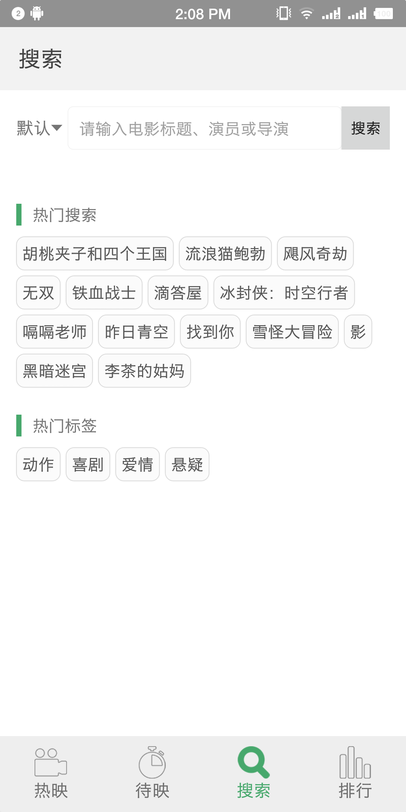
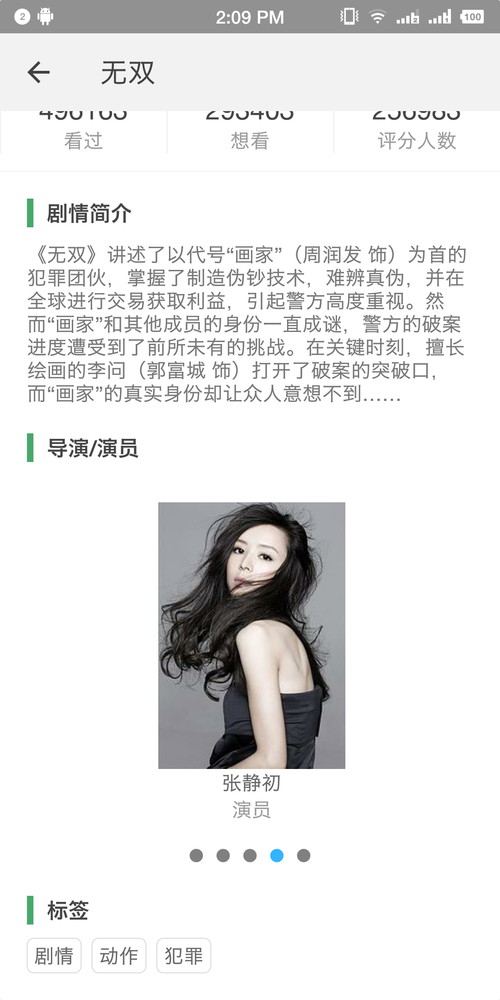
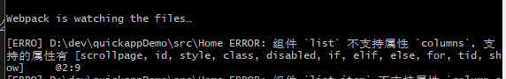

# douban quickapp

使用豆瓣api编写的[快应用](https://www.quickapp.cn/)

## 运行截图








## 开发总结

1. 目前社区不成熟，搜索引擎找不到任何资料，所以只能参照[官方文档](https://doc.quickapp.cn/)
2. 比如要设置`border-left`属性，不能像css一样简写，否则没任何效果也不报错，应当这么写：
```css
border-style: solid;
border-left-width: 10px;
border-left-color: #47a86c;
```
3. 封装组件，父组件传递属性给子组件，如果属性名称使用驼峰定义，如：hasMore，那么在外部传递数据时请使用-连接，如：has-more，如果不这样写，子组件内取不到值，[见文档](https://doc.quickapp.cn/tutorial/framework/parent-child-component-communication.html)
4. 父子组件属性传递可以通过属性名称直接传递下去，而如果要传递事件或者方法，可以通过事件触发，比如父组件监听`this.$on('onrefresh', this.onrefresh)`，子组件需要执行父组件内定义的`onrefresh`方法，只需要触发`onrefresh`事件即可:`this.$dispatch('onrefresh')`
5. `hap-cli`不能相信，可能工具的维护者更新不及时~哈哈哈，最终还是以官方文档为准，见下图，文档中list是有`columns`，`hap-cli`属性校验的属性枚举中没有`cloumns`属性（尴尬）  
6. 装上调试器和预览版app后，不一定要官网10个国内安卓厂商的安卓机才能跑快应用，我用的锤子一样可以跑
7. 我的调试方法：在代码内`console.info('quickappDemo 成功 this.start: ', this.start)`，命令行`adb logcat`，再用`grep`管道过滤一下日志就好了（我用的windows开发，配置android sdk环境变量的时候要指到`platform-tools`和`tools`目录）
8. 更好的调试方法：快应用调试器最下面有个开始调试按钮，手机上安装插件后可以在PC的chrome上调试，但是该方法浏览器代码刷新好像有问题（手机预览的代码与chrome source查看的代码不一致，chrome更新落后，如果代码变更需要点击开始调试按钮重新打开chrome页面）
9. 在ViewModel上定义`checkEmpty`方法避免渲染时读取 undefined 上的属性检查，防止出错，这里可以进行代码结构优化的目的是减小页面以及整体rpk包的体积，减少冗余代码。把`checkEmpty`定义到app.ux文件中，在每个ViewModel中通过`this.$app.$def.checkEmpty`即可取到util中定义的该方法